# Jason Smith Restaurant

Jason Smith Restaurant is about creativity, where different cuisines are fused together to create the ultimate fine dining experience.

Jason Smith Resturant only uses the finest of the ingredients to bring the ultimate experience for their consumers.

Jason Smith is trying to reach out to more people via the web.

In the home section you can see the brief history of the Resturant, what their food is about and some events which they host.

You can also make bookings in advance via the contacts section and even venture into the gallery where they have images showcasing some of the food which they create.

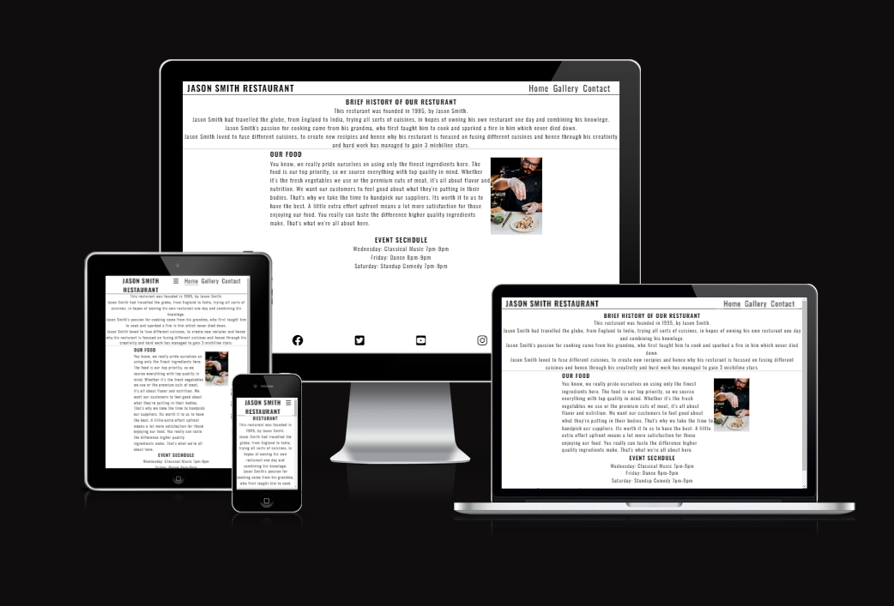

[You can view the website here](https://manraj101.github.io/Project-1/)

# Table of Content
*  ### [User Experience](#user-experience-1)
	*  [Goals](#goals)
* ### [Features](#features-1)
	* [Existing Features](#existing-features)
	* [Features Not Added](#features-not-added)
* ### [Design](#design-1)
* ### [Technologies Used](#technologies-used-1)
* ### [Frameworks, Libraries & Programs Used](#frameworks-libraries--programs-used-1)
* ### [Testing](#testing-1)
	* [Validation Results]()
	* [Manual Testing]()
	* [Lighthouse Report]()
* ### [Deployment and local development](#deployment-and-local-development-1)
	* [GitHub Pages](#github-pages)
	* [Forking the GitHub Repository](#forking-the-github-repository)
	* [Local Clone](#local-clone)
* ### [Credits](#credits-1)
* ### [Acknowledgements](#acknowledgements-1)

## User Experience

  

The website is meant to attract people who love food, and people who love fine dining.

There is a clear navigation system set up which will direct you to all three pages.

### Goals
* Learn about the restaurant.

* Easily navigate through the site.

* Be convinced to visit the restaurant.

### Frequent goals

* Check out the event schedule if there are any new events.

## Features
* This Website is targeting people who truly love fine dining and fusion foods.
* They can check out the gallery to look at stunning pictures of the food.
* They can check out the contact form to book in reservations in advance.
* Responsive on all device sizes.

### Existing Features:
* Navigation Bar
	 -   It is featured and fixed on all three pages and the form-received page.
	-   Includes links to the logo, home page, gallery, and sign-up page.
	-   It is identical in design across the pages.
	-   Allows easy navigation from page to page without having to revert back to the previous page via the 	 "back" button.

* Main Heading
	* It is Comprised of a simple white back-ground colour
		* Main heading is different each page,
			* On Home page it jumps straight to a "BRIEF HISTORY OF OUR RESTURANT"
			* On Gallery it is "WELCOME TO OUR GALLERY"
			* On Contact page it is "CONTACT US!"

* Home page
	* Section one starts off with a quick history of the restaurant.
	* Section two is talking about the quality of the food and how they only pick the highest quality of ingredients, with a picture of a chef.
	* Section three, shows the scheduled events talking place in the restaurant.  

* Footer
	* Has the social links to Instagram, X (twitter), YouTube
	* Also includes a google street view.
	* Everything opens in a separate window.
 * 

* Gallery
	* The gallery will provide the user with supporting images to see the different cuisines.
	*	This section is valuable to the user as they will get a sneak peak into our carefully selected menu.
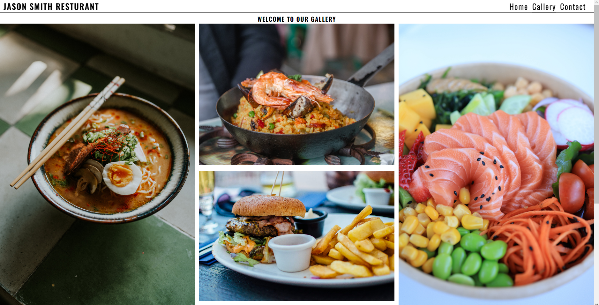

* Contact Page
	* Allows user to add in their personal details, and pick a date which they will like to come to restaurant.
	* Special Request section, allows user to type in the number of people, and any requests.
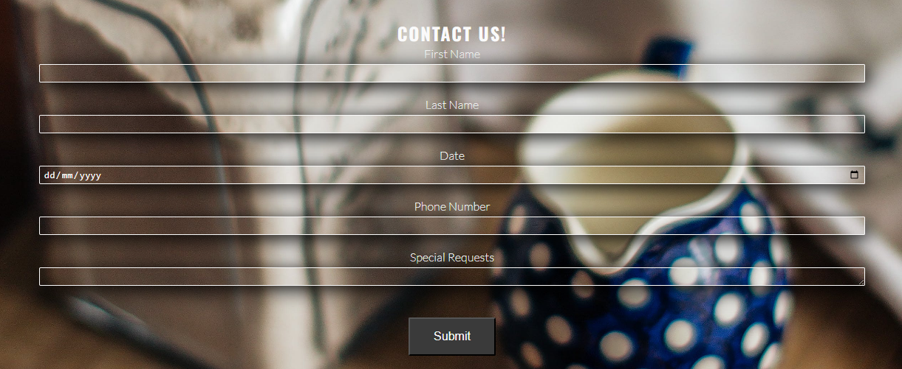

* Thank you page
	*Page to thank the user for contacting the resturant
  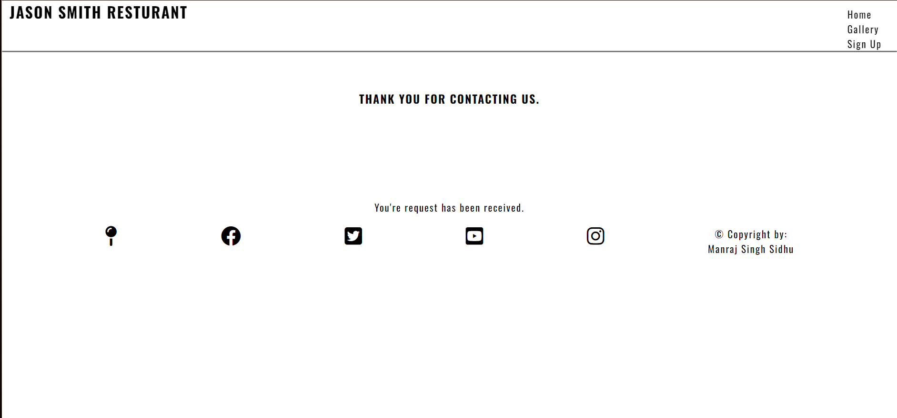 	
### Features not added
* In the future events might be changing
* 
## Design
* Typography
	* Oswald is the main font used with sans-serif as its fallback font in case Oswald doesn't import for some reason
* Wireframe
	* Mobile wireframe:
   		 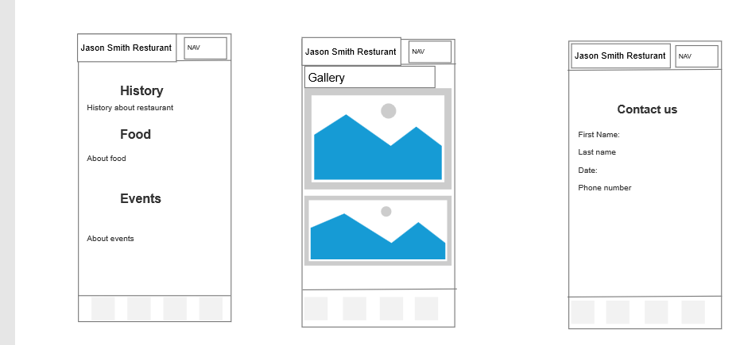

    	* Tablet wireframe:
   		 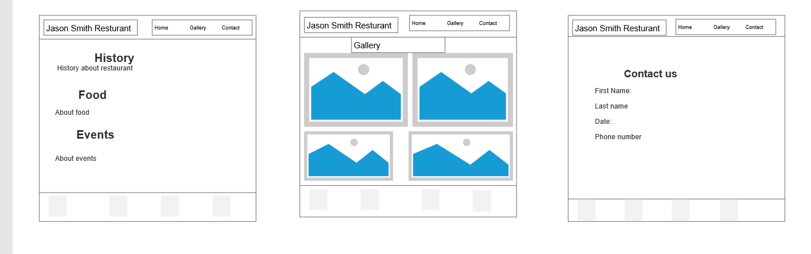
   	
    	* Desktop wireframe:
     		 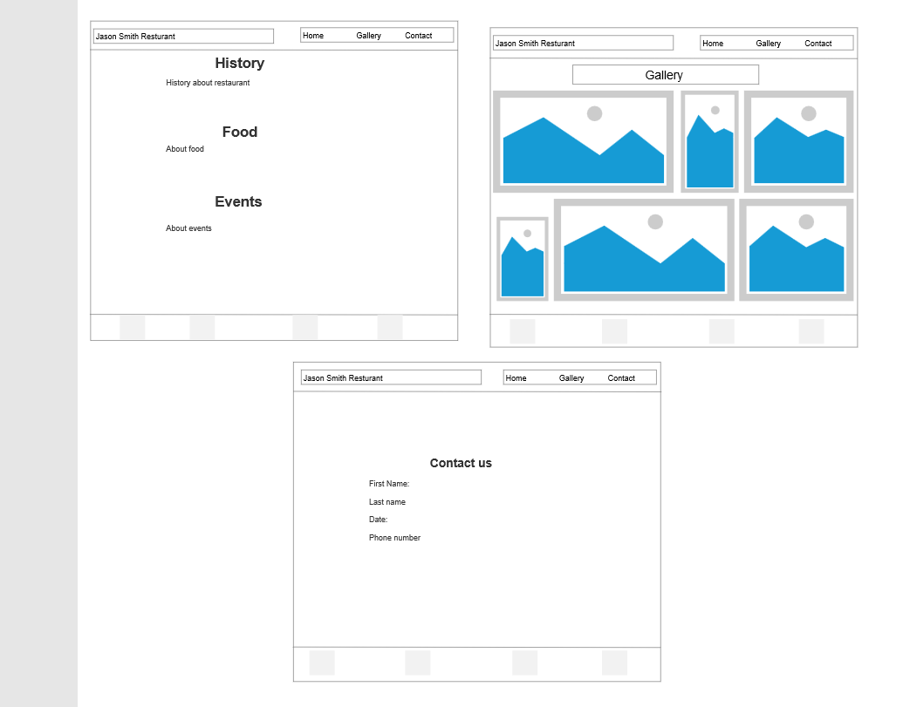 
   		
	
* Color Scheme
	* Primary colors used in this website:
   
   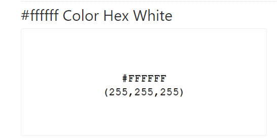
   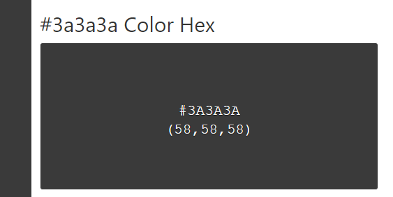
   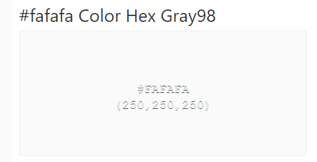
   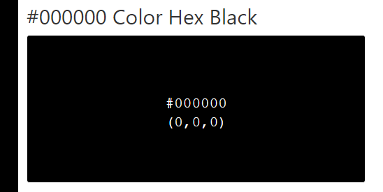

##  Technologies Used
* [HTML5](https://en.wikipedia.org/wiki/HTML5)
* [CSS](https://en.wikipedia.org/wiki/CSS)

## Frameworks, Libraries & Programs Used
* [Visual Studio Code](https://code.visualstudio.com)
	* To write the code.
* [Github](https://github.com)
	* To deploy the website and storing files online.
* [Google Fonts](https://fonts.google.com)
	* Import main fonts for the website.
* [Am I Responsive?](https://ui.dev/amiresponsive)
	* Mockup picture for the README file.
* [Axure RP](https://www.axure.com)
	* Used for making the wireframes. 	

## Testing
* W3C Markup Validator and W3C CSS Validator services were used to validate every page of the project to ensure there were no errors.
	* [W3C Markup Validtor](https://validator.w3.org/)
	* [W3C CSS Validator](https://jigsaw.w3.org/css-validator/)
### Validation results
* index.html
  
* gallery.html
  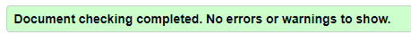
* contact.html
   
* style.css
  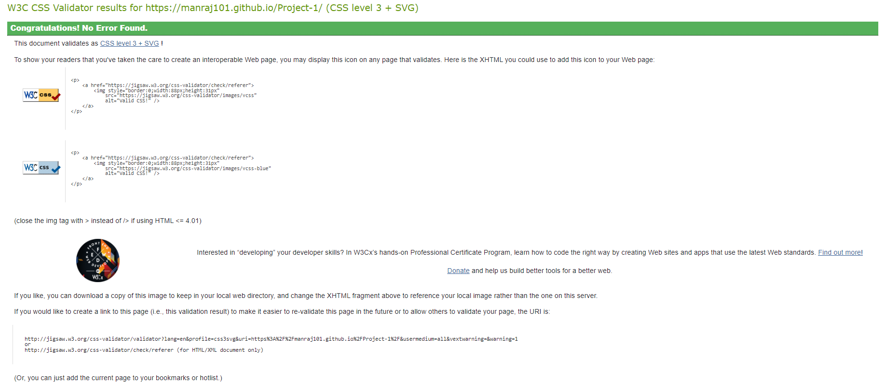   
* form-dump.html
  

### Manual Testing
* The website was tested on Google Chrome, Microsoft Edge, and Opera browsers.
*   The website was viewed on a desktop computer, laptop, and Samsung Galaxy Fold mobile phone.
*  A large amount of testing was done to ensure links between pages are working correctly on all pages.
*  Family and friends were asked to review the website for a better understanding of the user experience.
*   Dev Tools was used to test how the site looks on various screen sizes.

### Lighthouse Report
* Mobile resport
  
	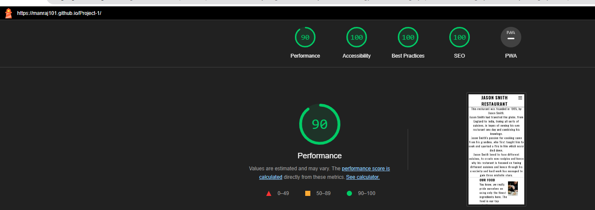

* Desktop report
  
	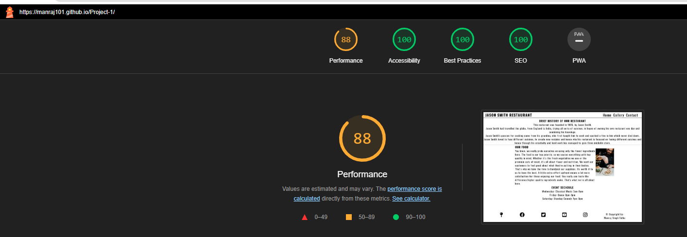
## Deployment and local development

### GitHub Pages

GitHub Pages used to deploy live version of the website.

1.  Log in to GitHub and locate  [GitHub Repository Project-1](https://github.com/Manraj101/Project-1)
2.  At the top of the Repository(not the main navigation) locate "Settings" button on the menu.
3.  Scroll down the Settings page until you locate "GitHub Pages".
4.  Under "Source", click the dropdown menu "None" and select "Main" and click "Save".
5.  The page will automatically refresh.
6.  Scroll back to locate the now-published site  [link](https://manraj101.github.io/Project-1/) in the "GitHub Pages" section.

### Forking the GitHub Repository

By forking the repository, we make a copy of the original repository on our GitHub account to view and change without affecting the original repository by using these steps:

1.  Log in to GitHub and locate  [GitHub Repository Project-1](https://github.com/Manraj101/Project-1)
2.  At the top of the Repository(under the main navigation) locate "Fork" button.
3.  Now you should have a copy of the original repository in your GitHub account.

### Local Clone

1.  Log in to GitHub and locate [GitHub Repository Project-1](https://github.com/Manraj101/Project-1)
2.  Under the repository name click "Clone or download"
3.  Click on the code button, select clone with HTTPS, SSH or GitHub CLI and copy the link shown.
4.  Open Git Bash
5.  Change the current working directory to the location where you want the cloned directory to be made.
6.  Type  `git clone`  and then paste The URL copied in the step 3.
7.  Press Enter and your local clone will be created.

## Credits
### Code
* Understanding the concept of grid was learned through  [Complete Guide to Grid](https://css-tricks.com/snippets/css/complete-guide-grid/)
* The README template was helpfully provided by  [Code Institute (template)](https://github.com/Code-Institute-Solutions/SampleREADME).

### Content
* All content was written by the developer.

### Media
* [Pexels](https://www.pexels.com/)  free stock photos, royalty free images.
* [Font Awesome](https://fontawesome.com/search?q=Lines&o=r&m=free) free icons.

## Acknowledgements
* My mentor Mitko Bachvarov provided me with a lot of helpful feedback, and helpful links such as link to CSS Complete Guide to Grid.
*  Slack community for encouragement and information.
